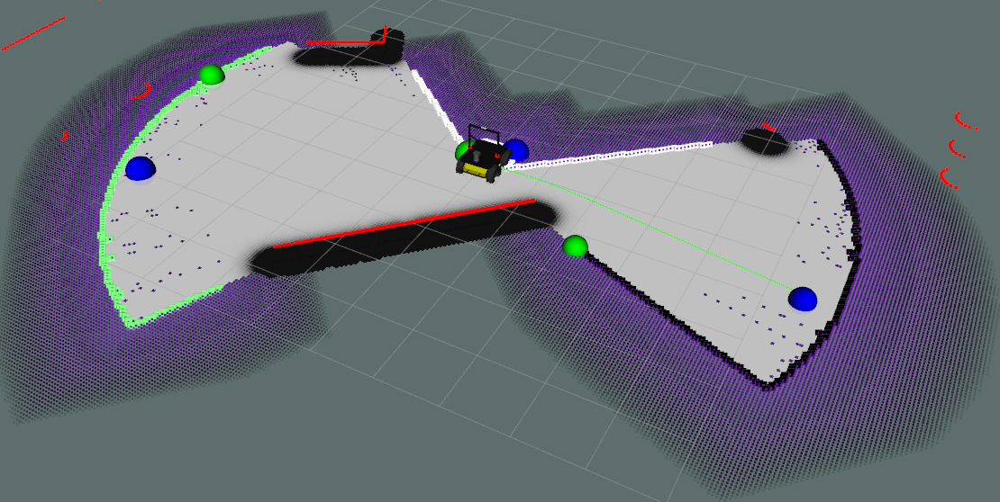
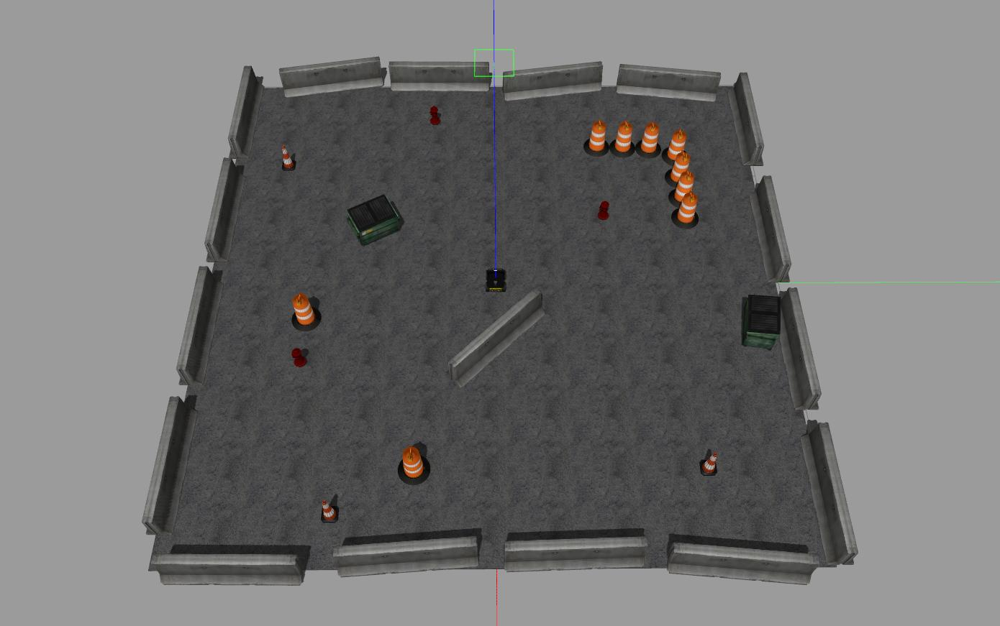
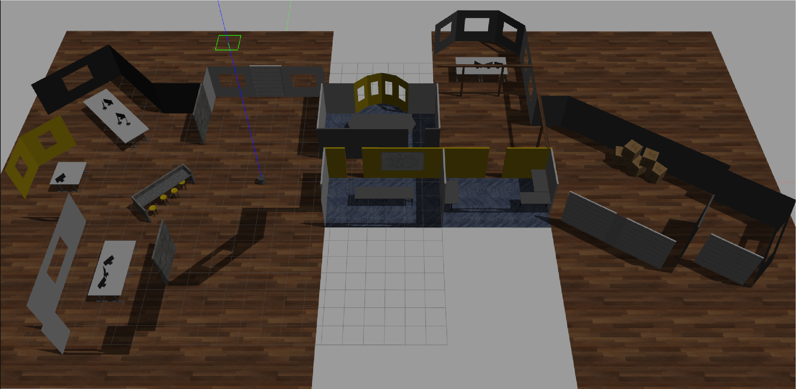

# DynamicEntropyExplore

## Overview

This is a template: replace, remove, and add where required. Describe here what this package does and what it's meant for in a few sentences.
This package contains the files 

**Keywords:** mobile robotics, autonomous mobile robotics, robot navigation, entropy, information theory.

### License

The source code is released under a [BSD 3-Clause license](ros_package_template/LICENSE).

**Author: Jaime Godoy-Calvo, Dahui Lin-Yang, Ricardo Váquez-Martín, Alfonso García-Cerezo 
Affiliation: [ISA, Universidad de Málaga](https://www.uma.es/isa) 
Maintainer: Ricardo Vázquez-Martín, rvmartin@uma.es**

The DynamicEntropyExplore package has been tested under [ROS] Melodic on Ubuntu 18.04.
This is research code, expect that it changes often and any fitness for a particular purpose is disclaimed.

### Publications

This work was used in an academic context.
If you use this work in an academic context, please cite the following publication(s):

* P. Fankhauser, M. Bloesch, C. Gehring, M. Hutter, and R. Siegwart: **PAPER TITLE**. IEEE/RSJ International Conference on Intelligent Robots and Systems (IROS), 2015. ([PDF](http://dx.doi.org/10.3929/ethz-a-010173654))

        @inproceedings{Fankhauser2015,
            author = {Fankhauser, P\'{e}ter and Hutter, Marco},
            booktitle = {IEEE/RSJ International Conference on Intelligent Robots and Systems (IROS)},
            title = {{PAPER TITLE}},
            publisher = {IEEE},
            year = {2015}
        }

## Installation

### Installation from Packages

To install all packages from the this repository use `rosdep`:

	sudo rosdep install --from-paths src --ignore-src -r -y
    

### Building from Source

#### Dependencies

- [Robot Operating System (ROS)](http://wiki.ros.org) (middleware for robotics)
- [Catkin Tools](https://catkin-tools.readthedocs.io/en/latest/index.html)

		sudo apt-get update
		sudo apt-get install python3-catkin-tools
	

#### Building

To build from source, clone the latest version from this repository into your catkin workspace and compile the package using

	git clone https://github.com/Jagoca98/DynamicEntropyExplore.git
	cd DynamicEntropyExplore/src
	rosdep install --from-paths . --ignore-src
	catkin build

## Usage

This package allow to perform an exploration in 2 different environments. The setup node will setup the world file and the needed nodes to perform an exploration. The exploration node will start the exploration of the environment.

Run the setup node for the `clearpath_playpen.world`:

	roslaunch fringa_pkg todo.launch

or run the `office.world` instead:

	roslaunch fringa_pkg office_todo.launch

The explore_costmap launch will start the run the exploration. This must be run in another terminal

	roslaunch fringa_pkg explore_costmap.launch

## Launch files

* **explore_costmap.launch:** shortly explain what is launched (e.g standard simulation, simulation with gdb,...)

     Argument set 1

     - **`robot_base_frame`**  (string, default: `"base_link"`)

	 Short description (e.g. as commented in launch file). Default: `default_value`.

    Argument set 2

    - **`...`**

* **...**

## Nodes

### ros_package_template

Reads temperature measurements and computed the average.

#### Subscribed Topics

* **`/temperature`** ([sensor_msgs/Temperature])

	The temperature measurements from which the average is computed.

#### Published Topics

...

#### Services

* **`get_average`** ([std_srvs/Trigger])

	Returns information about the current average. For example, you can trigger the computation from the console with

		rosservice call /ros_package_template/get_average

#### Parameters

* **`subscriber_topic`** (string, default: "/temperature")

	The name of the input topic.

* **`cache_size`** (int, default: 200, min: 0, max: 1000)

	The size of the cache.

### NODE_B_NAME

...

## Bugs & Feature Requests

Please report bugs and request features using the [Issue Tracker](https://github.com/ethz-asl/ros_best_practices/issues).

[ROS]: http://www.ros.org
[rviz]: http://wiki.ros.org/rviz
[Eigen]: http://eigen.tuxfamily.org
[std_srvs/Trigger]: http://docs.ros.org/api/std_srvs/html/srv/Trigger.html
[sensor_msgs/Temperature]: http://docs.ros.org/api/sensor_msgs/html/msg/Temperature.html
